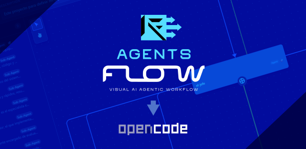

# AgentsFlow
> Design. Organize. Flow.  
> The easiest way to build agentic workflows for OpenCode — visually and intuitively.
---
## 🚀 What is AgentsFlow?
AgentsFlow is your desktop app for **designing and orchestrating agentic workflows** for OpenCode projects, without getting lost in code or complex configs.  
It’s focused on letting you create, visualize, and edit flows where different agents, tools, and automations connect — all with a clean, user-friendly interface.
- **Cross-platform:** Windows & Linux _(macOS coming soon!)_
- **Designed for creators & teams:** From curious beginners to workflow architects.
- **No coding required:** Just drag, drop, and design your agentic logic.
- **Perfect for OpenCode:** Build workflows that you can export, share or run inside OpenCode-powered environments.
---
✨ Features
- Visual editor for building and mapping agentic workflows
- Organize, connect, and configure agents and tools visually
- Modern, intuitive interface — for techies and non-techies alike
- Save, export, and version your flows
- Open Source: your logic, your rules
---
🏁 Download & Install
Windows 11
1. Download the installer:  
   AgentsFlow Setup 0.1.0.exe (https://github.com/aclCMNK/agent-flow-creator/releases/latest)
2. Double-click and follow the on-screen wizard  
3. Find AgentsFlow in your Start Menu and open it!
> Upgrading? Please close AgentsFlow before updating for a smooth install.
---
Linux (AppImage: runs on any distro!)
1. Download:  
   AgentsFlow-0.1.0.AppImage (https://github.com/aclCMNK/agent-flow-creator/releases/latest)
2. Make it executable:
      chmod +x AgentsFlow-0.1.0.AppImage
   3. Run it:
      ./AgentsFlow-0.1.0.AppImage
   
> No installation or root required.  
> For menu integration, check AppImageLauncher (https://github.com/TheAssassin/AppImageLauncher) (optional).
---
### macOS
Coming soon!  
Interested in early access? [Let us know in Issues](https://github.com/aclCMNK/agent-flow-creator/issues).
---
💡 Why AgentsFlow?
- Visual: Design agentic logic without code — just drag and connect.
- Clear: See your workflow structure at a glance.
- For OpenCode: Purpose-built for agentic development with the OpenCode community.
- Private & Open: All local, all open source — you own your workflows and your data.
---
👩‍💻 Build from Source & Contribute
Want to go deeper or contribute improvements?  
Everyone's welcome — from workflow tinkerers to seasoned devs!
Clone & install dependencies
git clone https://github.com/aclCMNK/agent-flow-creator.git
cd AgentsFlow
npm install
Run in development
npm run dev
Build the desktop app
# Windows
npm run build:win
# Linux
npm run build:linux
# (macOS soon!)
More
- Please see CONTRIBUTING.md (./CONTRIBUTING.md) for contributing guidelines.
- Found a bug or have a feature request? Open an issue (https://github.com/aclCMNK/agent-flow-creator/issues).
---
📣 Join Us
- Releases & downloads (https://github.com/aclCMNK/agent-flow-creator/releases)
- Feature requests / bug reports (https://github.com/aclCMNK/agent-flow-creator/issues)
- Star, share, and help AgentsFlow grow 🚀
---
> Design, not just code.  
> AgentsFlow — let your processes flow.
---

# AgentsFlow
> Diseña. Organiza. Fluye.  
> La manera más simple de crear flujos de trabajo agéntico para OpenCode — visual, fácil y poderosa.
---
## 🚀 ¿Qué es AgentsFlow?
AgentsFlow es una aplicación de escritorio pensada para **diseñar y orquestar flujos de trabajo agéntico** para proyectos OpenCode, sin perderse en el código ni configuraciones complicadas.  
Te permite crear, visualizar y editar flujos donde conectas distintos agentes, herramientas y automatizaciones de forma intuitiva y visual.
- **Multiplataforma:** Windows y Linux _(pronto en macOS!)_
- **Para creadores y equipos:** Desde entusiastas hasta arquitectos de flujos.
- **Sin necesidad de programar:** Arrastra, suelta y diseña tu lógica agentica.
- **Especial para OpenCode:** Prepara y ajusta flujos exportables y usables en entornos basados en OpenCode.
---
✨ Características
- Editor visual para construir y mapear flujos agénticos
- Organiza, conecta y configura agentes y herramientas de manera gráfica
- Interfaz moderna e intuitiva, para cualquier nivel técnico
- Guarda, exporta y versiona tus flujos de trabajo
- Código Abierto: tu lógica, tus reglas
---
🏁 Descarga e instalación
Windows 11
1. Descarga el instalador:  
   AgentsFlow Setup 0.1.0.exe (https://github.com/aclCMNK/agent-flow-creator/releases/latest)
2. Haz doble clic y sigue el asistente  
3. Encuentra AgentsFlow en tu Menú de Inicio y ábrelo
> ¿Vas a actualizar? Cierra AgentsFlow antes de instalar la nueva versión.
---
Linux (AppImage: ¡funciona en cualquier distro!)
1. Descarga:  
   AgentsFlow-0.1.0.AppImage (https://github.com/aclCMNK/agent-flow-creator/releases/latest)
2. Dale permisos de ejecución:
      chmod +x AgentsFlow-0.1.0.AppImage
   3. Ejecuta:
      ./AgentsFlow-0.1.0.AppImage
   
> No requiere instalación ni permisos de root.  
> Para integración en el menú, te recomendamos AppImageLauncher (https://github.com/TheAssassin/AppImageLauncher) (opcional).
---
### macOS
¡Muy pronto disponible!  
¿Te interesa ser tester temprano? [Avísanos en Issues](https://github.com/aclCMNK/agent-flow-creator/issues).
---
💡 ¿Por qué AgentsFlow?
- Visual: Diseña lógica agéntica sin escribir código; solo arrastra y conecta.
- Claro: Visualiza la estructura de tu flujo al instante.
- Para OpenCode: Pensado especialmente para la comunidad OpenCode y desarrollo agéntico.
- Privado & Open: Todo es local y abierto — tus flujos y datos te pertenecen.
---
👩‍💻 Instalar desde código fuente y contribuir
¿Quieres profundizar más o contribuir con mejoras?  
¡Cualquiera puede sumarse — desde exploradores de flujos hasta devs senior!
Clona e instala dependencias
git clone https://github.com/aclCMNK/agent-flow-creator.git
cd AgentsFlow
npm install
Ejecuta en modo desarrollo
npm run dev
Compila la app de escritorio:
# Windows
npm run build:win
# Linux
npm run build:linux
# (pronto para macOS)
Más info
- Revisa CONTRIBUTING.md (./CONTRIBUTING.md) para la guía de contribución.
- ¿Viste un bug o necesitas una feature? Abre un issue (https://github.com/aclCMNK/agent-flow-creator/issues).
---
📣 Súmate
- Releases y descargas (https://github.com/aclCMNK/agent-flow-creator/releases)
- Solicita características / reporta bugs (https://github.com/aclCMNK/agent-flow-creator/issues)
- Danos tu estrella, comparte y ayuda a AgentsFlow a crecer 🚀
---
> Diseño, no solo código.  
> AgentsFlow — deja fluir tus procesos.
---
